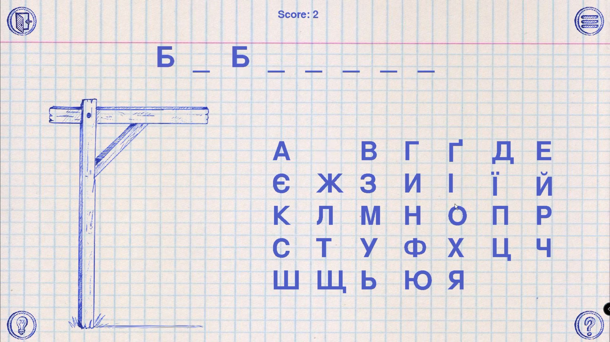
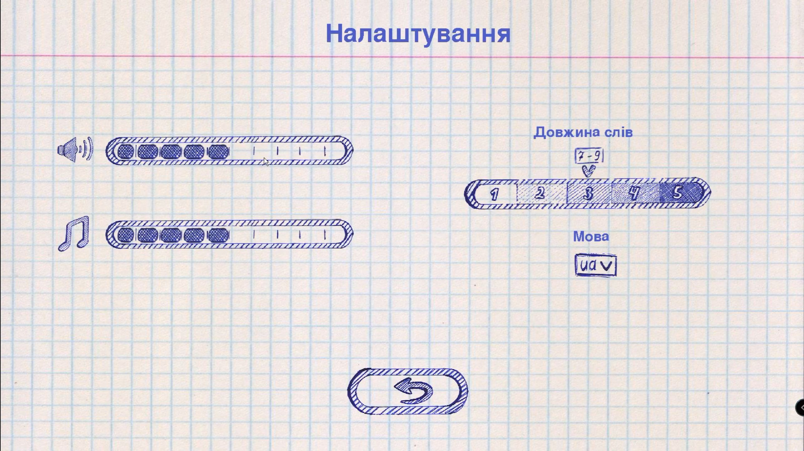

# 🞜 Hangedman (EN) 🞜

Hangman is a classic word-guessing game, where you need to guess the word by suggesting letters within a certain number of guesses.

## Rules

The game’s goal is to guess the hidden word by suggesting letters.

The hidden word is displayed on the screen with the underscore for each letter in the word (for exemple, “_ _ _ _ _”).

To suggest a letter you need to press the button with wanted letter.

If suggested letter was present in the hidden word, it will appear in the place of corresponding underscore (or underscores if the letter appears more than once in a word). Otherwise, the elements would be added elements to a hanged stick figure.

If you’ll successfully guess the word, before the stick figure will be complete, you will win.

If the stick figure will be complete before guessing the word, you will lose a game.

> Screenshots of the game.

  
# 🞜 Шибениця (UA) 🞜

Шибениця — це класична гра на вгадування слів, де вам потрібно вгадати слово, пропонуючи букви протягом певної кількості спроб.

## Правила:

Мета гри — вгадати приховане слово, пропонуючи букви.

Приховане слово відображається на екрані з використанням нижнього підкреслення для кожної букви в слові (наприклад, “_ _ _ _ _”).

Щоб запропонувати букву, потрібно натиснути кнопку з відповідною літерою.

Якщо запропонована буква присутня в прихованому слові, вона з’явиться на місці відповідного нижнього підкреслення (або декількох нижніх підкресленнь, якщо буква зустрічається в слові більше одного разу). В іншому випадку до підвішеної фігурки будуть додані елементи.

Якщо ви успішно вгадаєте слово до того, як фігурка буде завершена, ви виграєте.

Якщо фігурка буде завершена до вгадування слова, ви програєте гру.
  

# 🞜 Виселица (RU) 🞜

Виселица — это классическая игра на угадывание слов, в которой вам нужно угадать слово, предлагая буквы на протяжении определенного количества попыток.

  
## Правила:

Цель игры — угадать скрытое слово, предлагая буквы.

Скрытое слово отображается на экране с использованием нижнего подчеркивания для каждой буквы в слове (например, “_ _ _ _ _”).

Чтобы предложить букву, нужно нажать кнопку с соответствующей буквой.

Если предложенная буква присутствует в скрытом слове, она появится на месте соответствующего нижнего подчеркивания (или нескольких нижних подчеркиваний, если буква встречается в слове несколько раз). В противном случае к подвешенной фигурке будут добавлены элементы.

Если вы успешно угадаете слово до того, как фигурка будет завершена, вы выиграете.

Если фигурка будет собрана до того, как вы угадаете слово, вы проиграете игру.

## Изменения:
v 2.1
  1. Добавлено описание игры на 3 языках.
  2. Добавленны скриншоты.
  3. Файлы картинок и музыки добавленны в Git.

v 2.0
  1. Установлена максимальная длинна описания.
  2. Изменена анимация виселицы.
  3. Количество попыток увеличено до 10.
  4. Исправлены мелкие баги.
  5. Уточнены границы букв в алфавите.
  6. Добавлена секретная кнопка.

v 1.9
  1. Добавлены кнопки меню.
  2. Возможность включить и выключить звуки и музыку.
  3. Доступно меню настроек.
  4. Исправлены мелкие баги.
  5. Добавлена полоса регулирования звуков.
  6. Добавлена полоса регулирования музыки.
  7. Добавлена полоса регулирования длинны слов(сложности).
  8. Добавлен выбор языка.

v 1.8
  1. Перемещен вывод очков.
  2. Открытие слова после конца игры.
  3. Добавлена кнопка выхода из игры.
  4. Работает кнопка вызова меню.
  5. Исправлен баг с покупкой подсказок после окончания игры.
  6. Добавлена возможность сыграть в игру снова.
  7. Добавлены на экран сообщения о выигрыше и проигрыше.
  8. Добавлен звук нажатия на кнопку.
  9. Добавлена музыка.
  10. Добавлено название окна.
  11. Добавлена иконка.

v 1.7 (Играбельная!)
  1. Добавлена новая функция для вывода алфавита.
  2. Вывод засекреченного слова.
  3. Вывод очков.
  4. Вывод подсказки в отдельном поле. (Нажатие на поле закрывает его)
  5. Буквы алфавита - кнопки.
  6. Обработка нажатия на кнопки алфавита: при угадывании буквы она открывается на засекреченом слове и 
прибавляются очки, при неверном нажатии увеличевается переменная mistakes.
  7. Работает кнопка помощи, стоимость - 2 очка.
  8. Вывод сообщения о победе или поражении.

v 1.6
  1. Добавлены новые варианты фонов (можно переключать стрелкой вниз).
  2. Можно переключать анимацию виселицы стрелкой вверх.
  3. Стрелками влево, вправо можно регулировать размер экрана (плохо работает).
  4. Добавлен класс Button.
  5. Добавлены кнопки меню, описание, подсказка.
  6. При нажатии на кнопку "?" выводится описание.
  7. Добавлены функции чтения из json и выбора слова.
  8. Добавлен режим игры (mode = "game").

v 1.5
  1. Исправлен вывод ошибки ввода.
  2. Добавлен файл hangman_pygame.
  3. Добавлен файл шрифта BirchCTT.
  4. Добавлен фон.
  5. Разметка основных обьектов на экране.
  6. Отображена виселица и алфавит.
  7. Добавлена незаконченная функция по разширению разрешения.
  8. Добавлена незаконченная функция по выводу текста.

v 1.4
  1. Добавлен английский и украинский алфавиты.
  2. Сообщения на разных языках.
  3. Добавлено вступление.
  4. Добавлена сложность и возможность её выбора.
  5. Добавлена возможность продолжить игру.
  6. В начале игры можно выбрать язык.

v 1.3
  1. Добавлена обработка слов с дефисом.
  2. Добавлена обработка слов с буквой ё (ввод е = ввод ё).
  3. Вывод загаданного слова при победе.
  4. Добавлены очки.
  5. Помощь стоит 2 очка.

Embrace by Sappheiros | https://soundcloud.com/sappheirosmusic
Music promoted on https://www.chosic.com/free-music/all/
Creative Commons Attribution 3.0 Unported (CC BY 3.0)
https://creativecommons.org/licenses/by/3.0/
 